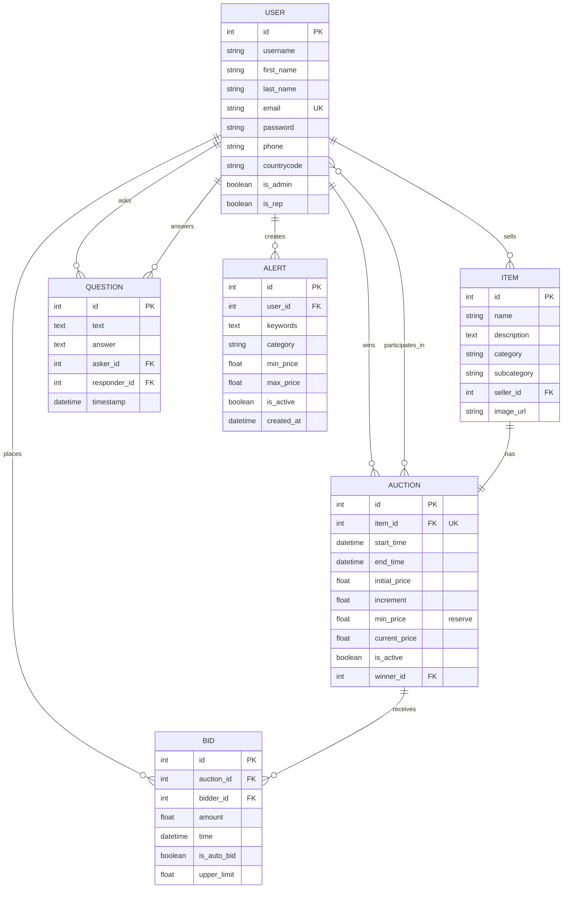

# BuyMe Database - ER Diagram


## Entity-Relationship Diagram



---

## Entities

### 1. USER
**Description:** Stores all user accounts including buyers, sellers, customer reps, and admins.

| Attribute | Type | Constraints | Description |
|-----------|------|-------------|-------------|
| id | INTEGER | PRIMARY KEY | Auto-increment user ID |
| username | VARCHAR(100) | NOT NULL | Display name |
| first_name | VARCHAR(100) | | User's first name |
| last_name | VARCHAR(100) | | User's last name |
| email | VARCHAR(100) | UNIQUE, NOT NULL | Login email |
| password | VARCHAR(255) | NOT NULL | Hashed password |
| phone | VARCHAR(20) | | Phone number |
| countrycode | VARCHAR(5) | | Country code for phone |
| is_admin | BOOLEAN | DEFAULT FALSE | Admin role flag |
| is_rep | BOOLEAN | DEFAULT FALSE | Customer rep flag |

---

### 2. ITEM
**Description:** Items being auctioned in the system.

| Attribute | Type | Constraints | Description |
|-----------|------|-------------|-------------|
| id | INTEGER | PRIMARY KEY | Auto-increment item ID |
| name | VARCHAR(200) | NOT NULL | Item name |
| description | TEXT | | Detailed description |
| category | VARCHAR(100) | NOT NULL | Main category |
| subcategory | VARCHAR(100) | | Subcategory |
| seller_id | INTEGER | FOREIGN KEY → USER(id), NOT NULL | Item owner |
| image_url | VARCHAR(500) | | Image URL |

---

### 3. AUCTION
**Description:** Auction events with timing and pricing information.

| Attribute | Type | Constraints | Description |
|-----------|------|-------------|-------------|
| id | INTEGER | PRIMARY KEY | Auto-increment auction ID |
| item_id | INTEGER | FOREIGN KEY → ITEM(id), UNIQUE, NOT NULL | Associated item |
| start_time | DATETIME | DEFAULT NOW | Auction start |
| end_time | DATETIME | NOT NULL | Auction close |
| initial_price | FLOAT | NOT NULL | Starting bid |
| increment | FLOAT | DEFAULT 1.0 | Minimum bid increase |
| min_price | FLOAT | | Secret reserve price |
| current_price | FLOAT | DEFAULT 0.0 | Highest bid |
| is_active | BOOLEAN | DEFAULT TRUE | Active status |
| winner_id | INTEGER | FOREIGN KEY → USER(id) | Winning bidder |

---

### 4. BID
**Description:** Bid history for all auctions.

| Attribute | Type | Constraints | Description |
|-----------|------|-------------|-------------|
| id | INTEGER | PRIMARY KEY | Auto-increment bid ID |
| auction_id | INTEGER | FOREIGN KEY → AUCTION(id), NOT NULL | Target auction |
| bidder_id | INTEGER | FOREIGN KEY → USER(id), NOT NULL | Bidder |
| amount | FLOAT | NOT NULL | Bid amount |
| time | DATETIME | DEFAULT NOW | Bid timestamp |
| is_auto_bid | BOOLEAN | DEFAULT FALSE | Auto-bid flag |
| upper_limit | FLOAT | | Max auto-bid amount |

---

### 5. QUESTION
**Description:** Q&A system for customer support.

| Attribute | Type | Constraints | Description |
|-----------|------|-------------|-------------|
| id | INTEGER | PRIMARY KEY | Auto-increment question ID |
| text | TEXT | NOT NULL | Question text |
| answer | TEXT | | Answer text |
| asker_id | INTEGER | FOREIGN KEY → USER(id), NOT NULL | User who asked |
| responder_id | INTEGER | FOREIGN KEY → USER(id) | Rep who answered |
| timestamp | DATETIME | DEFAULT NOW | Question time |

---

### 6. ALERT
**Description:** User notification preferences for items of interest.

| Attribute | Type | Constraints | Description |
|-----------|------|-------------|-------------|
| id | INTEGER | PRIMARY KEY | Auto-increment alert ID |
| user_id | INTEGER | FOREIGN KEY → USER(id), NOT NULL | Alert owner |
| keywords | TEXT | | Comma-separated keywords |
| category | VARCHAR(100) | | Category filter |
| min_price | FLOAT | | Minimum price |
| max_price | FLOAT | | Maximum price |
| is_active | BOOLEAN | DEFAULT TRUE | Active status |
| created_at | DATETIME | DEFAULT NOW | Creation time |

---

## Relationships

### One-to-Many Relationships

#### USER → ITEM (Seller)
- **Type:** One-to-Many
- **Description:** A user can sell multiple items
- **Foreign Key:** `ITEM.seller_id` references `USER.id`
- **Cardinality:** 1 user : N items

#### USER → BID (Bidder)
- **Type:** One-to-Many
- **Description:** A user can place multiple bids
- **Foreign Key:** `BID.bidder_id` references `USER.id`
- **Cardinality:** 1 user : N bids

#### USER → QUESTION (Asker)
- **Type:** One-to-Many
- **Description:** A user can ask multiple questions
- **Foreign Key:** `QUESTION.asker_id` references `USER.id`
- **Cardinality:** 1 user : N questions

#### USER → QUESTION (Responder)
- **Type:** One-to-Many
- **Description:** A customer rep can answer multiple questions
- **Foreign Key:** `QUESTION.responder_id` references `USER.id`
- **Cardinality:** 1 user : N answers

#### USER → ALERT
- **Type:** One-to-Many
- **Description:** A user can create multiple alerts
- **Foreign Key:** `ALERT.user_id` references `USER.id`
- **Cardinality:** 1 user : N alerts

#### AUCTION → BID
- **Type:** One-to-Many
- **Description:** An auction receives multiple bids
- **Foreign Key:** `BID.auction_id` references `AUCTION.id`
- **Cardinality:** 1 auction : N bids

#### USER → AUCTION (Winner)
- **Type:** One-to-Many
- **Description:** A user can win multiple auctions
- **Foreign Key:** `AUCTION.winner_id` references `USER.id`
- **Cardinality:** 1 user : N won auctions

---

### One-to-One Relationships

#### ITEM ↔ AUCTION
- **Type:** One-to-One
- **Description:** Each item has exactly one auction
- **Foreign Key:** `AUCTION.item_id` references `ITEM.id` (UNIQUE)
- **Cardinality:** 1 item : 1 auction

---

### Many-to-Many Relationships

#### USER ↔ AUCTION (Participants)
- **Type:** Many-to-Many
- **Description:** Users participate in auctions by bidding
- **Join Table:** `auction_participants`
- **Cardinality:** N users : N auctions

**Join Table Structure:**
```sql
auction_participants (
    user_id INTEGER FK → USER(id),
    auction_id INTEGER FK → AUCTION(id),
    PRIMARY KEY (user_id, auction_id)
)
```

---

## Key Constraints & Business Rules

### Primary Keys
- All tables have auto-incrementing integer primary keys

### Foreign Keys
1. `ITEM.seller_id` → `USER.id`
2. `AUCTION.item_id` → `ITEM.id` (UNIQUE)
3. `AUCTION.winner_id` → `USER.id`
4. `BID.auction_id` → `AUCTION.id`
5. `BID.bidder_id` → `USER.id`
6. `QUESTION.asker_id` → `USER.id`
7. `QUESTION.responder_id` → `USER.id`
8. `ALERT.user_id` → `USER.id`

### Unique Constraints
- `USER.email` - Ensures unique login
- `AUCTION.item_id` - Ensures one auction per item

### Business Rules
1. **Bidding Rules:**
   - Bid amount must be ≥ current_price + increment
   - Sellers cannot bid on their own items
   - Auto-bid amount cannot exceed upper_limit

2. **Auction Rules:**
   - end_time must be after start_time
   - Auction winner only set if reserve price (min_price) is met
   - current_price starts at initial_price

3. **User Roles:**
   - is_admin=TRUE: Full system access
   - is_rep=TRUE: Can answer questions, reset passwords
   - Regular users: Can buy and sell

4. **Question Rules:**
   - Only customer reps (is_rep=TRUE) can answer
   - answer is NULL until answered by a rep

5. **Alert Rules:**
   - Keywords stored as comma-separated text
   - is_active controls whether alert checks occur

---

## Indexing Strategy

### Recommended Indexes

```sql
-- Foreign key indexes (automatic in most DBMS)
CREATE INDEX idx_item_seller ON ITEM(seller_id);
CREATE INDEX idx_auction_item ON AUCTION(item_id);
CREATE INDEX idx_auction_winner ON AUCTION(winner_id);
CREATE INDEX idx_bid_auction ON BID(auction_id);
CREATE INDEX idx_bid_bidder ON BID(bidder_id);
CREATE INDEX idx_question_asker ON QUESTION(asker_id);
CREATE INDEX idx_question_responder ON QUESTION(responder_id);
CREATE INDEX idx_alert_user ON ALERT(user_id);

-- Performance indexes
CREATE INDEX idx_auction_active ON AUCTION(is_active);
CREATE INDEX idx_auction_endtime ON AUCTION(end_time);
CREATE INDEX idx_bid_time ON BID(time);
CREATE INDEX idx_item_category ON ITEM(category);
CREATE INDEX idx_alert_active ON ALERT(is_active);
```

---

## Database Statistics

| Metric | Count |
|--------|-------|
| Total Entities | 6 |
| Total Relationships | 11 |
| One-to-One | 1 |
| One-to-Many | 9 |
| Many-to-Many | 1 |
| Foreign Keys | 8 |
| Unique Constraints | 2 |

---

## SQL Schema

```sql
-- Users table
CREATE TABLE users (
    id INTEGER PRIMARY KEY AUTO_INCREMENT,
    username VARCHAR(100) NOT NULL,
    first_name VARCHAR(100),
    last_name VARCHAR(100),
    email VARCHAR(100) UNIQUE NOT NULL,
    password VARCHAR(255) NOT NULL,
    phone VARCHAR(20),
    countrycode VARCHAR(5),
    is_admin BOOLEAN DEFAULT FALSE,
    is_rep BOOLEAN DEFAULT FALSE
);

-- Items table
CREATE TABLE items (
    id INTEGER PRIMARY KEY AUTO_INCREMENT,
    name VARCHAR(200) NOT NULL,
    description TEXT,
    category VARCHAR(100) NOT NULL,
    subcategory VARCHAR(100),
    seller_id INTEGER NOT NULL,
    image_url VARCHAR(500),
    FOREIGN KEY (seller_id) REFERENCES users(id)
);

-- Auctions table
CREATE TABLE auctions (
    id INTEGER PRIMARY KEY AUTO_INCREMENT,
    item_id INTEGER UNIQUE NOT NULL,
    start_time DATETIME DEFAULT CURRENT_TIMESTAMP,
    end_time DATETIME NOT NULL,
    initial_price FLOAT NOT NULL,
    increment FLOAT DEFAULT 1.0,
    min_price FLOAT,
    current_price FLOAT DEFAULT 0.0,
    is_active BOOLEAN DEFAULT TRUE,
    winner_id INTEGER,
    FOREIGN KEY (item_id) REFERENCES items(id),
    FOREIGN KEY (winner_id) REFERENCES users(id)
);

-- Bids table
CREATE TABLE bids (
    id INTEGER PRIMARY KEY AUTO_INCREMENT,
    auction_id INTEGER NOT NULL,
    bidder_id INTEGER NOT NULL,
    amount FLOAT NOT NULL,
    time DATETIME DEFAULT CURRENT_TIMESTAMP,
    is_auto_bid BOOLEAN DEFAULT FALSE,
    upper_limit FLOAT,
    FOREIGN KEY (auction_id) REFERENCES auctions(id),
    FOREIGN KEY (bidder_id) REFERENCES users(id)
);

-- Questions table
CREATE TABLE questions (
    id INTEGER PRIMARY KEY AUTO_INCREMENT,
    text TEXT NOT NULL,
    answer TEXT,
    asker_id INTEGER NOT NULL,
    responder_id INTEGER,
    timestamp DATETIME DEFAULT CURRENT_TIMESTAMP,
    FOREIGN KEY (asker_id) REFERENCES users(id),
    FOREIGN KEY (responder_id) REFERENCES users(id)
);

-- Alerts table
CREATE TABLE alerts (
    id INTEGER PRIMARY KEY AUTO_INCREMENT,
    user_id INTEGER NOT NULL,
    keywords TEXT,
    category VARCHAR(100),
    min_price FLOAT,
    max_price FLOAT,
    is_active BOOLEAN DEFAULT TRUE,
    created_at DATETIME DEFAULT CURRENT_TIMESTAMP,
    FOREIGN KEY (user_id) REFERENCES users(id)
);

-- Auction participants (many-to-many)
CREATE TABLE auction_participants (
    user_id INTEGER,
    auction_id INTEGER,
    PRIMARY KEY (user_id, auction_id),
    FOREIGN KEY (user_id) REFERENCES users(id),
    FOREIGN KEY (auction_id) REFERENCES auctions(id)
);
```

---

**Database Design Complete**  
Total of 6 entities with 11 relationships supporting a full-featured online auction platform.
