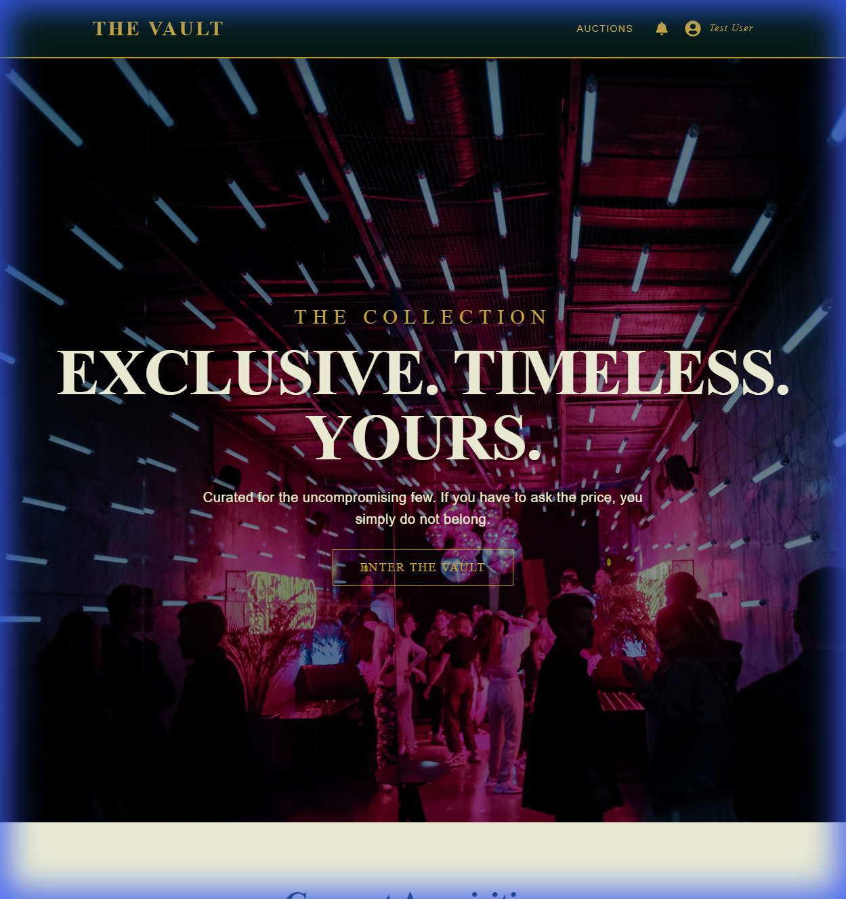
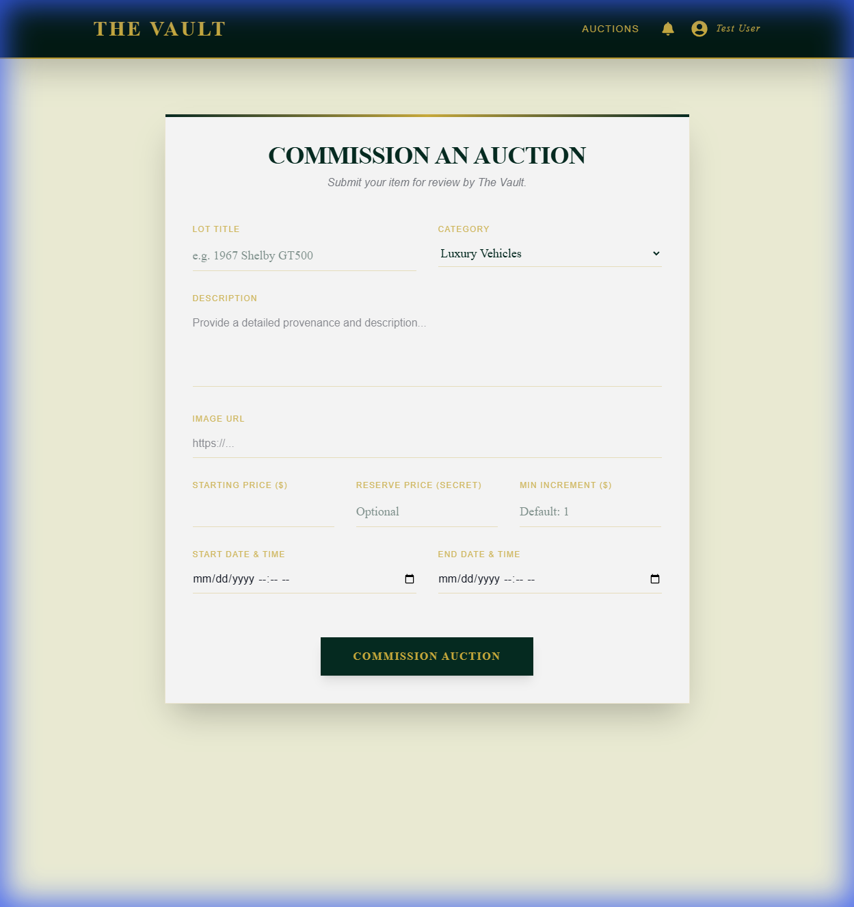
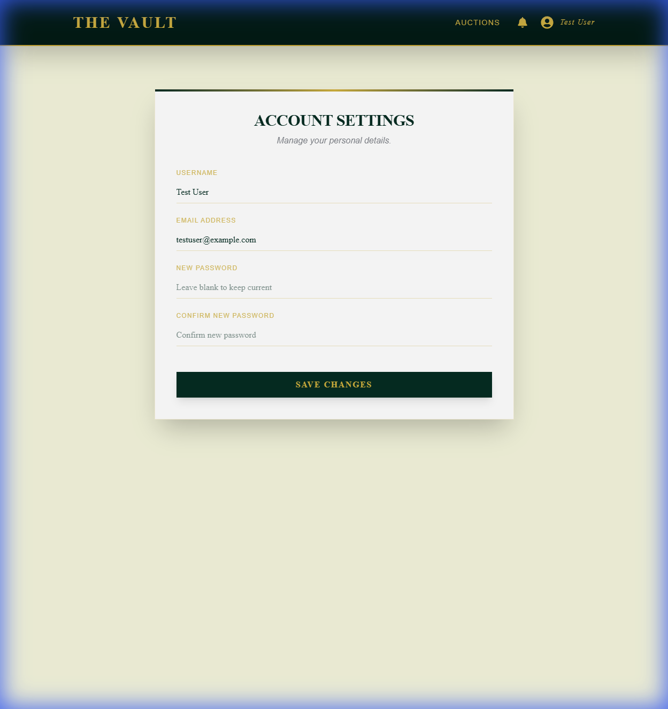
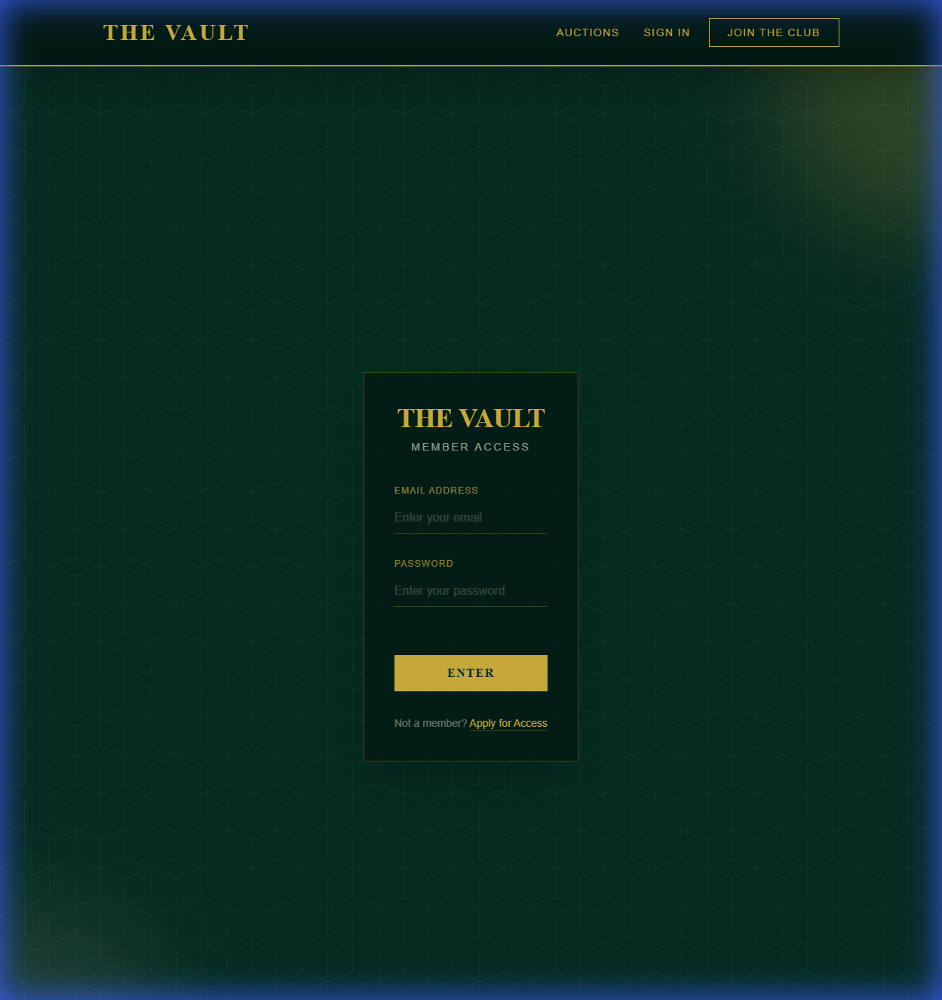
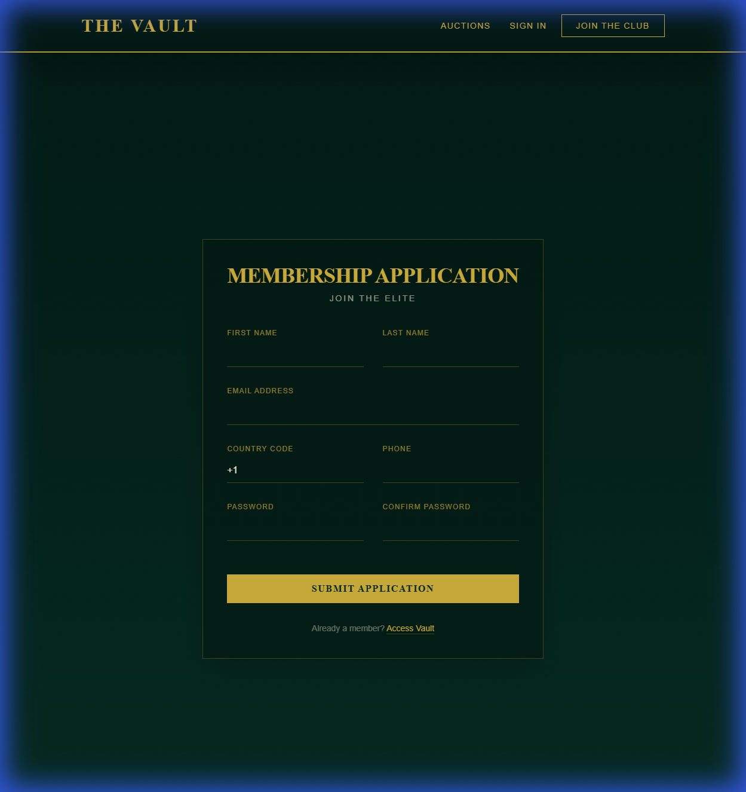
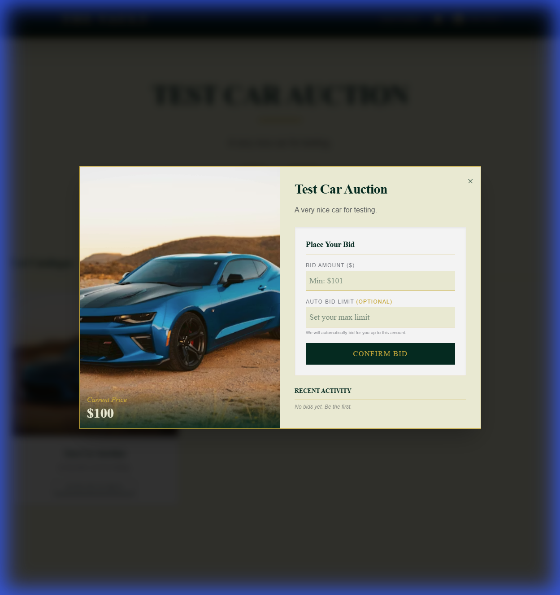
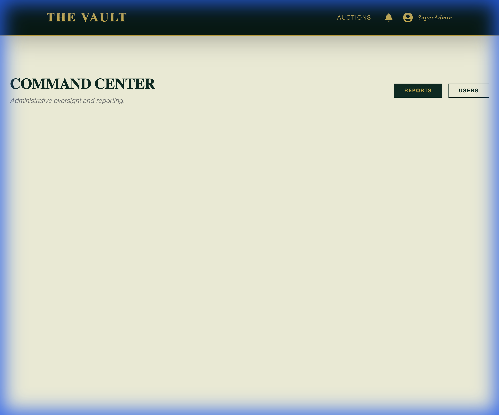
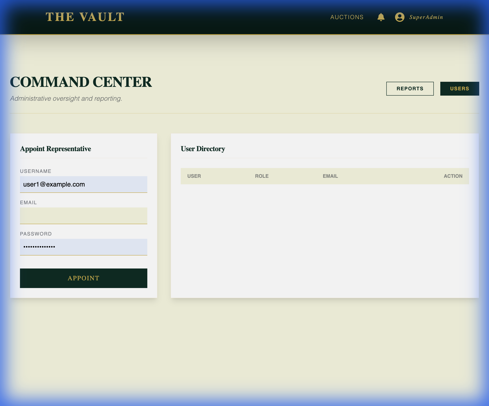
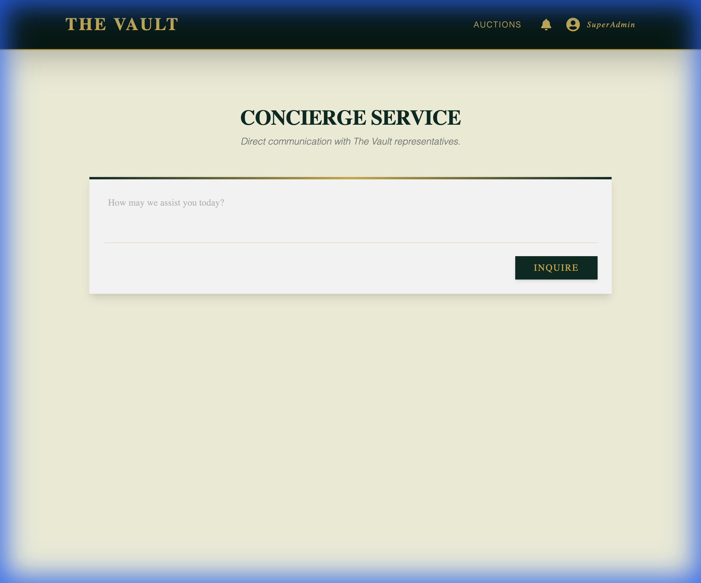
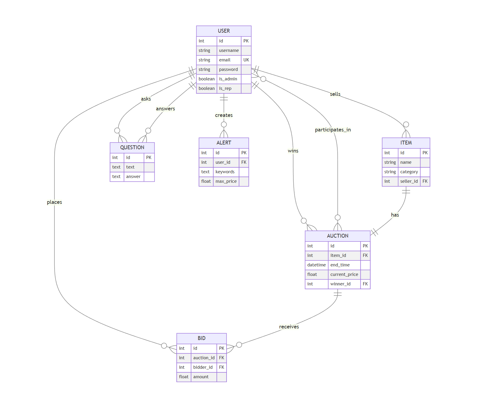

# BuyMe Auction Platform 🛍️

> A CS 527 Database Systems for Data Science Project

> [!NOTE] 
> **Latest UI Update:** We had a last minute change to the UI for the project in the last hour to provide a premium dark-themed experience. Hence, the images in the readme below are the older ones and do not reflect the current modern aesthetics.



A comprehensive, full-stack online auction platform built with **React** and **Flask**, featuring real-time bidding, role-based access control, and advanced administrative capabilities.

---

## 🌟 Feature Showcase

### 🏠 Browse & Discover
Advanced search functionality allows users to filter by category, price range, and keywords.


### 🔨 Create Auctions
Sellers can easily list items with images, starting prices, and reserve prices.


### 👤 User Dashboard
Track your bidding history, view your listed auctions, and manage your account.


### 🔐 Secure Authentication
Robust login and registration system using JWT tokens and password hashing.
<div style="display: flex; gap: 10px;">
  
  
</div>

### 📦 Detailed Item Views
Comprehensive auction details showing current price, bid history, and item status.


### 🛠️ Admin Control Panel
Powerful administrative tools for managing the marketplace ecosystem.

#### 1. Command Center / Reports
View real-time earnings, best-selling items, and category performance.


#### 2. User Management
Manage platform users, including appointing customer representatives.


#### 3. Q&A Management
Oversee and moderate user questions and answers.


---

## 🏗️ Technical Architecture

### Backend (Flask)
- **Framework**: Flask (Python)
- **Database**: MySQL with SQLAlchemy ORM
- **Authentication**: JWT & Werkzeug Security
- **API Design**: RESTful architecture

### Frontend (React)
- **Framework**: React.js with Vite
- **Styling**: CSS Modules / Modern CSS
- **State Management**: Redux Toolkit Query
- **Routing**: React Router

---

## ✅ CS 527 Requirements Met (100% Completion)

### 👥 End-User Features
- [x] Account Creation & Management
- [x] Create & Manage Auctions
- [x] Advanced Item Search (Keywords, Category, Price)
- [x] Real-time Bidding & Auto-Bidding
- [x] **[NEW]** Similar Items Search Algorithm
- [x] **[NEW]** Item Alerts System
- [x] **[NEW]** User Bid & Auction History

### 🛡️ Administrative Features
- [x] Customer Representative & Admin Roles
- [x] **[NEW]** Reset User Passwords
- [x] **[NEW]** Remove Bids & Cancel Auctions
- [x] Sales Reports (Total Earnings, Top Items, Best Buyers)

---

## 🚀 Quick Start Guide

### 1. Clone & Setup
```bash
git clone https://github.com/Haadesx/CS527-Final-Project-BuyMe.git
cd CS527-Final-Project-BuyMe
```

### 2. Backend Setup
```bash
cd backend_flask
python -m venv venv
# Windows: venv\Scripts\activate
# Mac/Linux: source venv/bin/activate
pip install -r requirements.txt
python seed_data.py # Optional: Seeds admin/test data
python app.py
```

### 3. Frontend Setup
```bash
cd ..
npm install
npm run dev
```

### 4. Access App
Open `http://localhost:5000` in your browser.

---

## 📊 Database Schema



---

## 👥 Contributors

*   **Varesh Patel** - `vp752`
*   **I. Swanith reddy** - `si393`
*   **Harsh Gharlute** - `hg525`

**CS 527: Database Systems for Data Science**  
Rutgers University

---

